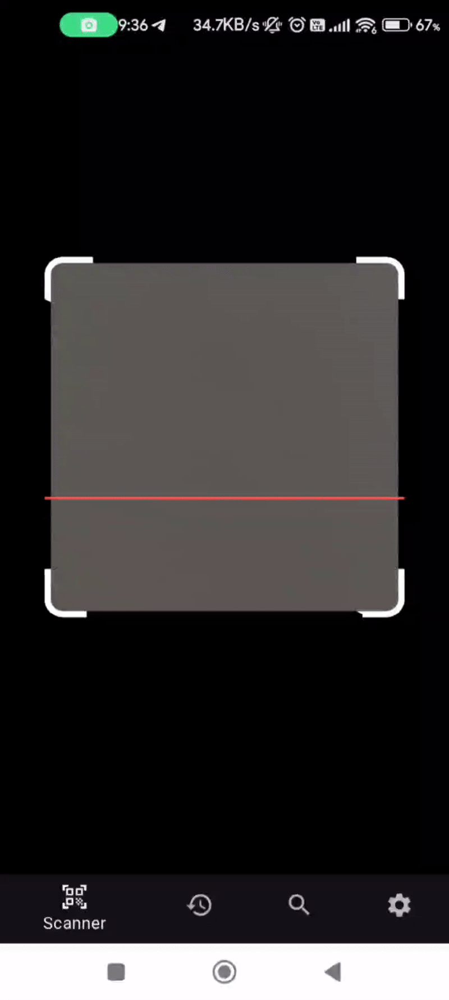

The internet is filled with shortened URLs, suspicious links, and phishing traps. I built **SafeLink Scanner**, a Flutter app that helps users **check if a link is safe before opening it**.

---

## 🔍 What the App Does

SafeLink Scanner lets users:

- Paste or share a link from another app
- Automatically check the URL against known threat databases:
  - 🛡️ [URLHaus](https://urlhaus.abuse.ch/)
  - 🔎 [urlscan.io](https://urlscan.io/)
- Get a clear warning or green-light based on results
- See a visual preview or breakdown of the destination site

---

## 🧰 Tech Stack

| Layer | Tools & Tech |
| --- | --- |
| 💻 Frontend | Flutter + Dart |
| 🌐 APIs | URLHaus, urlscan.io |
| 🎨 Design | Custom UI/UX (Flutter widgets) |
| 📱 Platforms | Android (iOS planned) |

---

## Lessons Learnt

- 🔐 Calling and parsing JSON from public security APIs  
- 🧩 Building resilient UI for error states, results, and sharing  
- 🧠 Security-first thinking in product design  
- 📦 Optimizing network calls and response time

---

## 📸 App Demo

---

## 🔗 GitHub Repository

➡️ <https://github.com/radioblodo/safelink_scanner>
